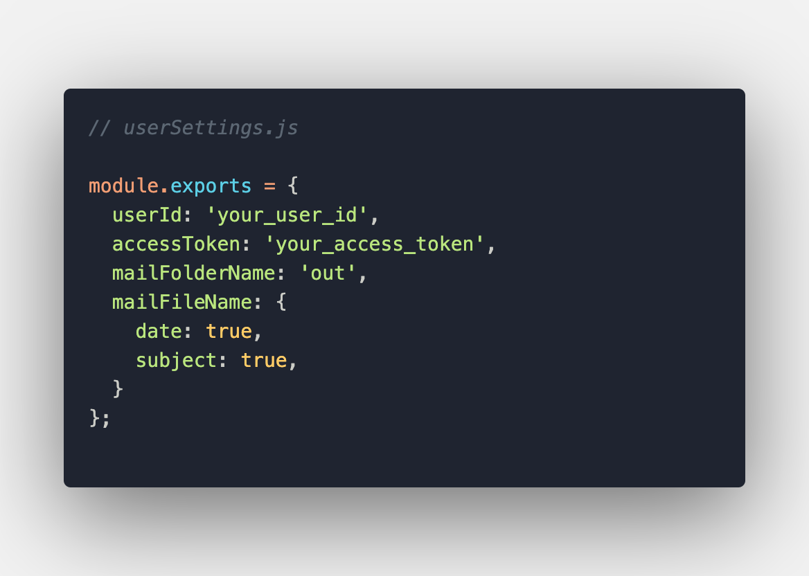

# IZ\*ONE Private Mail Backup 아이즈원 프라이빗 메일 백업 (Node) 
### A simple script to fetch, save, and view all your private mails.

***Latest release: [April 14, 2021](#release-logs)***   
***README last updated: April 15, 2021***

* [Intro](#intro)
* [Pre-reqs](#pre-reqs)
* [Steps](#steps)
* [Folder structure](#folder-structure)
* [Release logs ](#release-logs)
* [Troubleshooting](#troubleshooting)

## Intro

PM officially announced service will be terminated on May 31, 2021, 23:59 (JST), and the members will stop sending mail on April 28, 2021, 23:59 (JST). This script will likely stop working when service is terminated.

This script fetches every single mail you have ever received from the members you are subscribed to, and saves each mail as a static HTML file, which can be viewable indefinitely. All images are downloaded from PM's server, and saved as an image file.

## Pre-reqs
- npm
- Node.js
- Private Mail user ID (in the app's settings)
- Private Mail acess token
  - Located in the HTTP request header. The header can be captured using a proxy.

## Steps
1. Clone or download this repo  
`git clone https://github.com/anniegiang/izone-private-mail-archive.git`
2. Open `userSettings.js` and fill in your info:  

3. `npm install`
4. `npm run start` (run this when you want to get the latest mail)

All mails are saved as a static `html` file in the output folder specified in `userSettings.js`. Each mail can be viewable in the browser.

After mails are fetched from PM's server and saved as  `html` files, there are two ways to view mail: 

1. View all your mails at once by opening `index.html` in the browser. Don't use any live server clients to open it.

2. Open mails individually from the output folder.

***Always keep the mail id at the start of mail html files, as the script uses them to save mails efficiently, and to know if your inbox is updated or not.***

## Folder structure
`index.html` => A list of all your mails after fetching and saving your mails  (viewable in the browser)
 
`out/memberKoreanName/` => individual `html` mail files
 
`out/memberKoreanName/images` => individual images live here

## Release logs 

Pull or rebase the `master` branch for the latest changes.

### 4/14/2021
- Can now customize the filename of mails in `userSettings.js` (date and subject).  

### 4/11/2021
- By default mail filenames will now include the mail subject. For example: `m12121__Mon-Oct-29-2018__안녕🖐__.html`.
- Renaming mail filenames is now ok, but names must still begin with the mail id.
- `index.html` file will now be created at the initial inbox fetch.
- Fetches used to terminate if the newest mail is already saved. Now, each fetch will not terminate early to ensure your inbox is not only updated, but is also completely full.

### 4/10/2021
- You can now view all you mails in `index.html` after mails are fetched and saved. If you ran the script before, please delete all your mails in your output folder, and re-reun `npm run start`. 

## Troubleshooting

`Error saving mail, [Error: EILSEQ: illegal byte sequence]`
- This may happen if the the mail's filename has emojis. Try configuring your machine to accept special encoded characters and convert them to be UTF-8. Or, go to `userSettings.js` and set `mailFileName.subject` to be `false` to remove the mail subject from the filename.